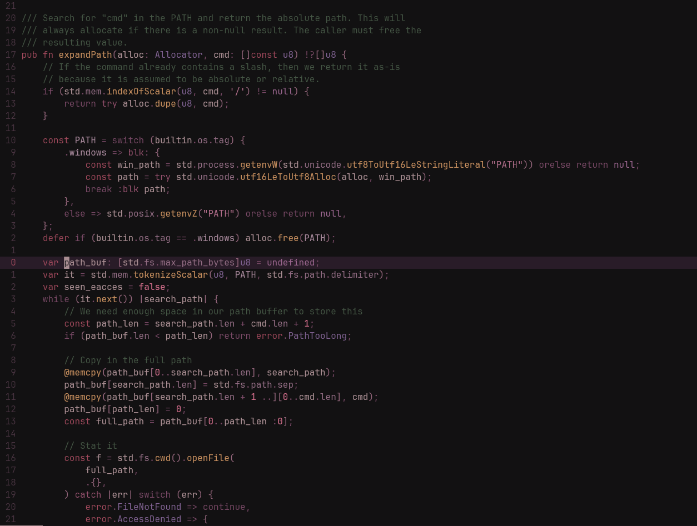

# Targino

It's [Gruvball](https://github.com/mrwilford/gruvball) but different.

##### Zig code - Ghostty



## Usage

Lazy:
```lua
{
  "vallahor/targino-nvim",
  lazy = false,
  priority = 1000,
  opts = {},
}
```

Custom LSP highlights
```lua
vim.diagnostic.config({
  signs = {
    linehl = {
      [vim.diagnostic.severity.ERROR] = "DiagnosticLinehlError",
      [vim.diagnostic.severity.WARN] = "DiagnosticLinehlWarn",
      [vim.diagnostic.severity.INFO] = "DiagnosticLinehlInfo",
      [vim.diagnostic.severity.HINT] = "DiagnosticLinehlHint",
    },
    numhl = {
      [vim.diagnostic.severity.ERROR] = "DiagnosticNumhlError",
      [vim.diagnostic.severity.WARN] = "DiagnosticNumhlWarn",
      [vim.diagnostic.severity.INFO] = "DiagnosticNumhlInfo",
      [vim.diagnostic.severity.HINT] = "DiagnosticNumhlHint",
    },
  },
})

```
